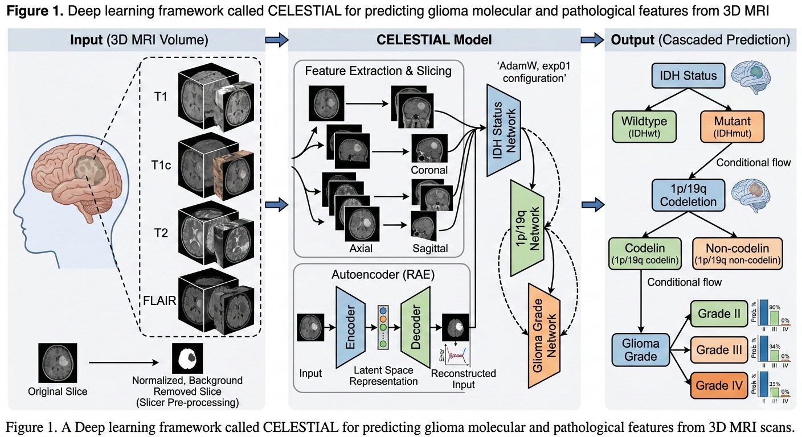
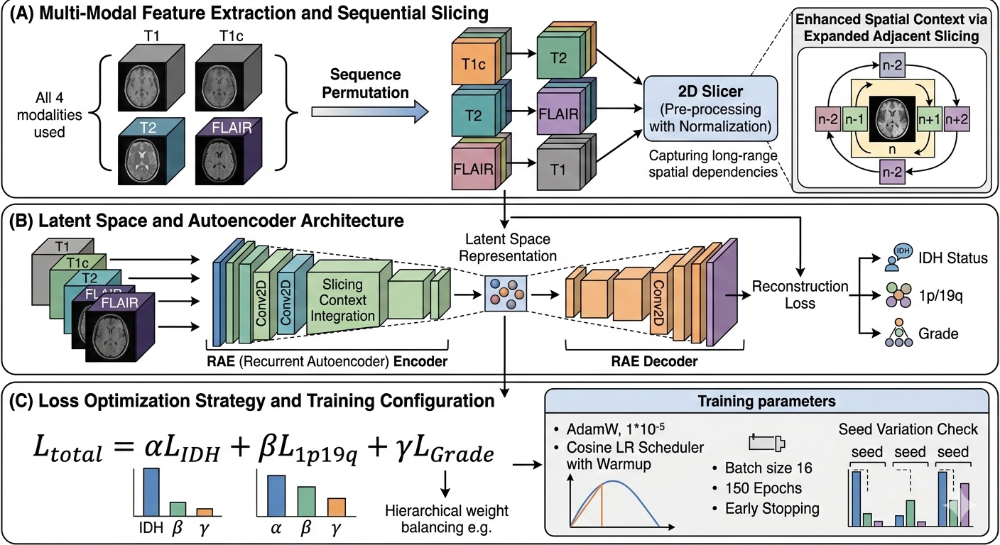
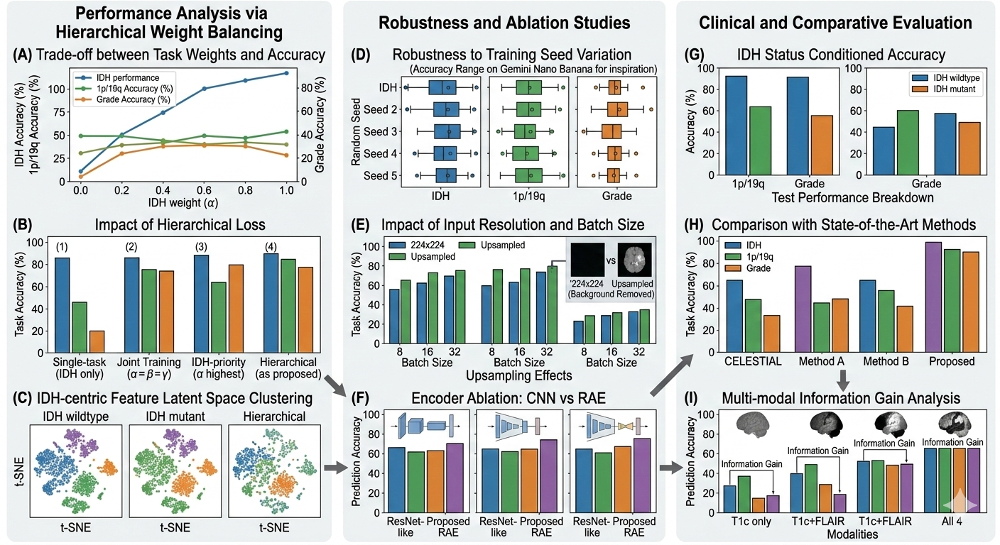

# CELESTIAL

**CELESTIAL: Cascaded Embedding and Latent Encoding via Slicing for Triple-task IDH-centric Autoencoder Learning**

> [한국어 문서](./README_KR.md) · [Korean](./README_KR.md)

---

## Overview

CELESTIAL is a hierarchical multi-task learning framework for glioma molecular subtype classification from multi-modal MRI. It simultaneously predicts three clinically critical biomarkers—**IDH mutation status**, **1p/19q co-deletion**, and **WHO Grade**—following the hierarchical dependency structure defined by the 2021 WHO CNS tumor classification.

The system integrates:
- **3D MRI → 2D Slice Extraction** via tumor-area-maximizing slicing (axial / coronal / sagittal)
- **DINOv2 ViT-g/14** as a frozen vision backbone (embedding dim: 1536)
- **ClinicalEncoder** for age and sex co-variate fusion
- **Cascaded Hierarchical Heads** with WHO-constraint penalty loss

---

## Figures

### Architecture Overview



### Slice Preprocessing



### Grad-CAM Visualization



---

## Module Structure

| File | Role |
|---|---|
| `HAEDAL_Classifier.py` | DINOv2-based hierarchical classifier (IDH → 1p19q → Grade) |
| `HAEDAL_ClinicalClassifier.py` | Clinical-integrated classifier (ClinicalEncoder + hierarchical heads) |
| `HAEDAL_Loss.py` | Hierarchical loss + WHO-constraint penalty |
| `HAEDAL_Config.py` | Hyperparameter dataclass |
| `HAEDAL_Slicer.py` | 3D MRI → 2D slice extraction (max-tumor-area per axis) |
| `HAEDAL_Loader.py` | PNG-based Dataset / DataLoader |
| `HAEDAL_Metrics.py` | Multi-metric computation + TSV export |
| `HAEDAL_Trainer.py` | Training loop with early stopping |
| `HAEDAL_Tester.py` | Test evaluation loop |
| `run_slicer.py` | NIfTI → PNG preprocessing + train/test CSV generation |
| `run_trainer.py` | Training entry script |
| `run_tester.py` | Test entry script |

---

## Data Pipeline

### Step 0 — Preprocessing (once)

```bash
python run_slicer.py \
    --csv       datasets/EGD_slice.csv \
    --label_csv datasets/EGD_Final.csv \
    --out       slices_out \
    --csv_out   datasets \
    --img_size  224 \
    --workers   4 \
    --seed      42
```

Each subject → **12 PNG** files (224×224 grayscale), 3 axes × 4 modalities:

```
slices_out/{subject_id}/
    axial_T1.png    axial_T1ce.png    axial_T2.png    axial_FLAIR.png
    coronal_T1.png  coronal_T1ce.png  coronal_T2.png  coronal_FLAIR.png
    sagittal_T1.png sagittal_T1ce.png sagittal_T2.png sagittal_FLAIR.png
```

Slice selection: the slice with the **largest tumor area** in the segmentation mask per axis.

### Step 1 — Training

```bash
CUDA_VISIBLE_DEVICES=0 python run_trainer.py \
    --experiment exp01 \
    --epochs     150 \
    --batch_size 16
```

### Step 2 — Testing

```bash
CUDA_VISIBLE_DEVICES=0 python run_tester.py \
    --checkpoint output/exp01/checkpoints/best.pt
```

---

## Model Architecture

```
image [B, 3, 224, 224]  →  DINOv2 ViT-g/14  →  img_feat  [B, 1536]
age_group, sex_bin      →  ClinicalEncoder  →  clin_feat [B, 64]
                                                          ↓
                                            fused [B, 1600]
                                                          ↓
                                            idh_head   → idh_logits   [B, 2]
                                                ↓ + idh_context [B, 128]
                                            codel_head → codel_logits [B, 2]
                                                ↓ + genetic_context [B, 256]
                                            grade_head → grade_logits [B, 3]
```

**Input encoding:**
- Each sample: 3 axis slices of one MRI modality → stacked as RGB `[3, 224, 224]`
- One subject generates 4 samples (T1 / T1ce / T2 / FLAIR)

**ClinicalEncoder:**
`Linear(2→64) → ReLU → Dropout(0.1) → Linear(64→64) → ReLU`

| Raw feature | Encoding |
|---|---|
| `age` (float) | 0 = Young (< 45), 1 = Old (≥ 45) |
| `sex` (M/F) | 0 = Female, 1 = Male |

---

## Loss Function

```
L_total = w_idh × L_idh
        + w_codel × L_codel × dependency_mask
        + w_grade × L_grade × dependency_mask
        + penalty

dependency_mask : 0.2× suppression for samples where IDH is predicted incorrectly
penalty         : +2.0 when IDH-wt is predicted as 1p19q-codeleted (WHO violation)
weights         : w_idh=3.0, w_codel=1.0, w_grade=1.0
```

---

## Evaluation Metrics

Per-task (IDH / 1p19q / Grade):

| Metric | Description |
|---|---|
| `acc` | Accuracy |
| `bal_acc` | Balanced Accuracy |
| `f1_macro` | Macro F1 |
| `auc` | ROC-AUC (binary tasks) |
| `auc_ovr` | OvR AUC (Grade, multiclass) |
| `mcc` | Matthews Correlation Coefficient |
| `kappa` | Cohen's Kappa |

**Overall score** = (mean_acc + IDH_AUC) / 2

---

## Outputs

```
output/{exp}/
    checkpoints/best.pt          # Best checkpoint
    checkpoints/latest.pt        # Latest checkpoint
    history.json                 # Full epoch history
    history_metrics.tsv          # Per-epoch metrics (train + val)
    test_metrics_{ts}.tsv        # Test metrics
    test_results_{ts}.csv        # Per-sample predictions
```

---

## Requirements

```
torch==2.5.1+cu124
torchvision==0.20.1+cu124
numpy
Pillow>=10.0
nibabel
scikit-learn>=1.3
opencv-python
matplotlib
```

```bash
pip install torch==2.5.1+cu124 torchvision==0.20.1+cu124 \
    --index-url https://download.pytorch.org/whl/cu124
pip install numpy Pillow nibabel scikit-learn opencv-python matplotlib
```

---

## Dataset

- **EGD (Erasmus Glioma Database)**: multi-modal brain MRI (T1, T1ce, T2, FLAIR) with segmentation masks
- Labels: IDH status, 1p/19q co-deletion, WHO grade, age, sex
- Split: 70% train / 30% test (stratified, `seed=42`)

---

## Label Encoding

| Label | Value |
|---|---|
| `idh` | 0=wild-type, 1=mutant, -1=unknown |
| `codel` | 0=non-codeleted, 1=codeleted, -1=unknown |
| `grade` | 0=Grade2, 1=Grade3, 2=Grade4, -1=unknown |
